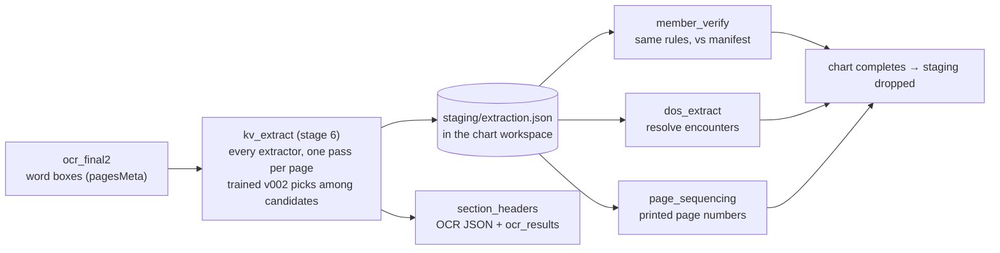

# Key/value extraction

One stage, right after OCR, finds every field the later stages read. It replaces the
separate member, DOS, page-number and section-header extraction those stages each did
for themselves. Code: [`core-pipeline/stages/lib/extraction/`](../core-pipeline/stages/lib/extraction/).

| Field | Staged as | Used by |
|-------|-----------|---------|
| Member name, DOB, ID | `name`, `dob`, `member_id` | `member_verify` (checked against the manifest) |
| Date of service | `dos` | `dos_extract` (resolved across the chart) |
| Printed page number | `page_no` | `page_sequencing` (explicit markers) |
| Headings | `heading_heron` | written to `section_headers` in the OCR JSON / `ocr_results` |
| Provider name | `provider_name` | staged only — nothing reads it yet |
| E-signature | `electronic_signature` | staged only — nothing reads it yet |

What the pipeline **stores did not change**: `member_extraction_results`,
`member_verification_summary`, `dos_extraction_results`, the sequencing rows and the
`section_headers` of the OCR JSON have the same columns, CSVs and meanings.

## Flow



1. **Extract** — `stage.py` reads each page's Final2 word boxes and runs the extractors
   once per page (`pipeline.py`): GLiNER reads key/value sentences, geometry rules find the
   rest, the Heron layout detector boxes headings on the page image the OCR read (the
   corrected page when rotation changed it).
2. **Pick** — the rules find every candidate; the trained version (`models/kv_ranker/v002`,
   LightGBM) scores them and chooses. v002 is the only version integrated. A version that is
   not on disk fails the stage — it never falls back to rules silently.
3. **Stage** — `staging.py` writes `data/folders/<chart>/staging/extraction.json`. A row is
   the extractor's own (key, sentence, value, score, `accepted`, `selected`, source).
4. **Use** — each later stage reads its fields from staging. If staging is missing (the chart
   already completed and you re-run one stage with `only`), `ensure_staging` re-runs the
   extraction from the stored OCR — no OCR cost.
5. **Drop** — when a whole-chain run finishes `completed` / `needs_review`, the orchestrator
   deletes the staging. A partial run (`only`, `through`) keeps it.

No overlays are drawn, nothing is written to Excel, and no training data is collected by the
pipeline.

## How verification reads the staging

The rules are the reference's (`rules/`); only where the page's name, DOB and ID come from
changed. See `stages/lib/member/engine.py`.

* **Name** — the member names the extraction accepted on the page. The one that matches the
  manifest is the detected name, else the one it selected.
* **DOB / member ID** — *present* when an extracted value says what the manifest says
  (`rules/field_match.py`: the V1 comparisons, plus month-name dates). The value shown is the
  matching one, else the selected one — a page with someone else's DOB shows that DOB.
* **Wrong member** — every accepted member name on a page that failed verification; none
  matching the expected member ⇒ `wrong_member`.
* `detection_source_*` is `ner` when GLiNER read the value, `rule_based` otherwise;
  `ner_key_source_*` is the key the value was found under.

## Pages with no word boxes

Only Final2 (Azure Document Intelligence) stores word boxes. Final1 (Docling/RapidOCR) keeps
text only. A page that never went to Final2 — **a high-quality printed page skips the billed
Azure call** — has nothing to extract from: it is skipped as `no_word_boxes`, left out of
staging, and the later stages treat it as a page the extraction found nothing on (member
verification: not verified; DOS: no date). This is logged as a warning per chart and reported
in the stage result (`pages_no_word_boxes`). Closing the gap is an OCR-policy decision (run
Final2 on those pages, or export Docling's word cells).

## Models

Side by side under `core-pipeline/models/` (`EXTRACTION_MODELS_ROOT`):

```
gliner_low/        GLiNER small-v2.1 + encoder/        (not committed)
layout_heron/      docling-layout-heron                (not committed)
kv_ranker/v002/    trained ranker, thresholds, vocab   (committed, ~1 MB)
```

`python -m stages.lib.extraction.util.model_setup` (from `core-pipeline/`) downloads a missing
GLiNER / Heron folder at its pinned revision (`util/config.py`) and checks the trained version. `GET /health` →
`extraction` says whether the packages and weights are there.

Settings: `EXTRACTION_MODELS_ROOT`; the version is pinned to v002 in `config.py` (no env override),
`EXTRACTION_DATA_ROOT` (training tools only). Packages: `requirements-extraction.txt`.

## Training

`stages/lib/extraction/training/` is the module's training code, unchanged apart from imports.
The pipeline does **not** produce its input: reviewed runs and their OCR/images are brought
into `EXTRACTION_DATA_ROOT` (`Runs/`, `OCR_Output/`, `Raw/`) from wherever they were reviewed.
Run from `core-pipeline/`:

```bash
python -m stages.lib.extraction.training.dataset            # snapshot reviewed runs
python -m stages.lib.extraction.training.train --description "..."
python -m stages.lib.extraction.training.evaluate --version v003
python -m stages.lib.extraction.training.crossval
```

A new version is written to `models/kv_ranker/vNNN`; the pipeline keeps running v002 until `EXTRACTION_MODEL_VERSION` in `config.py` is changed.
The Review UI that produces the reviews is not part of this repo.

## Simulating a document

`scripts/simulate_extraction.py` runs the real stages on a prepared document (its OCR JSON as
Final2, its images) against the in-memory store — no OCR, no Postgres:

```bash
cd core-pipeline
python ../scripts/simulate_extraction.py <folder with OCR/*.json and RAW/> \
    --member "First Last" --dob MM/DD/YYYY --member-id ID
```
