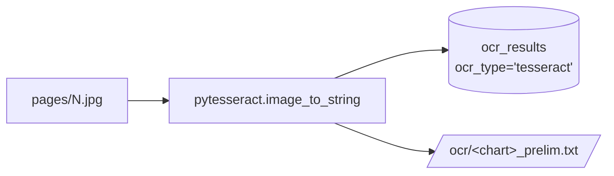
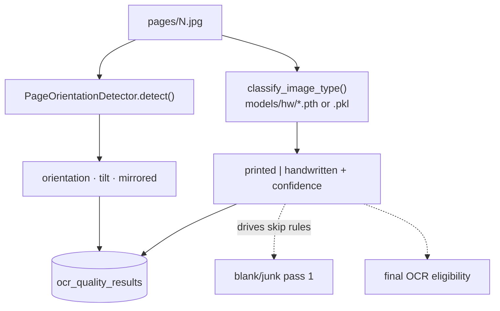
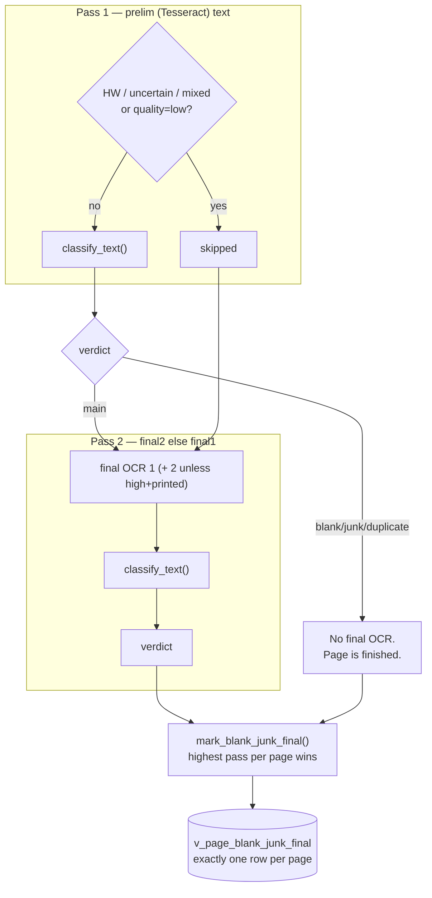
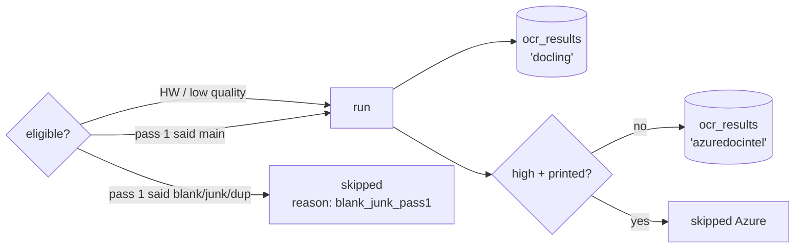
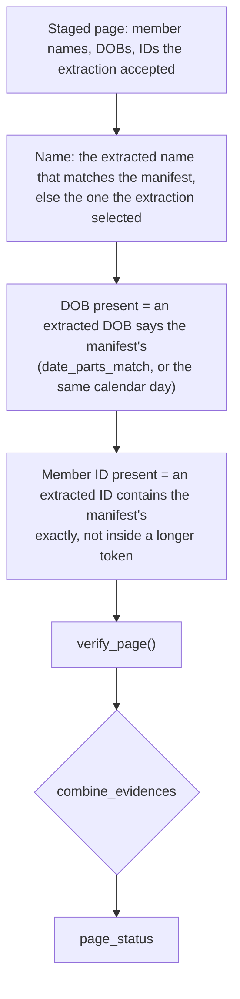
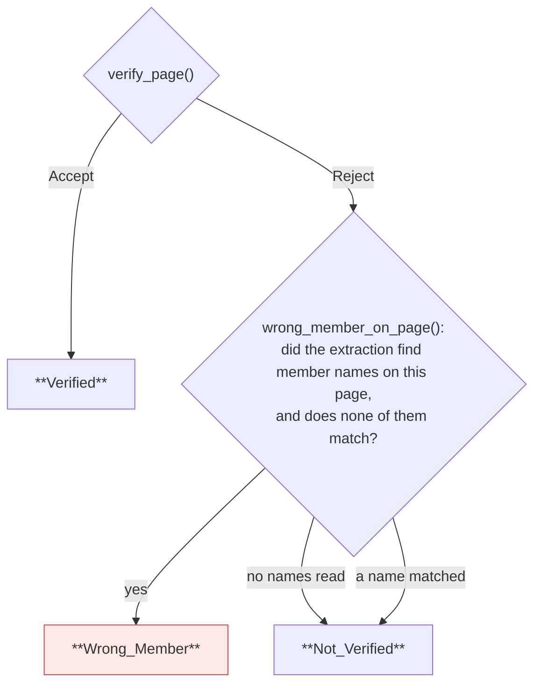
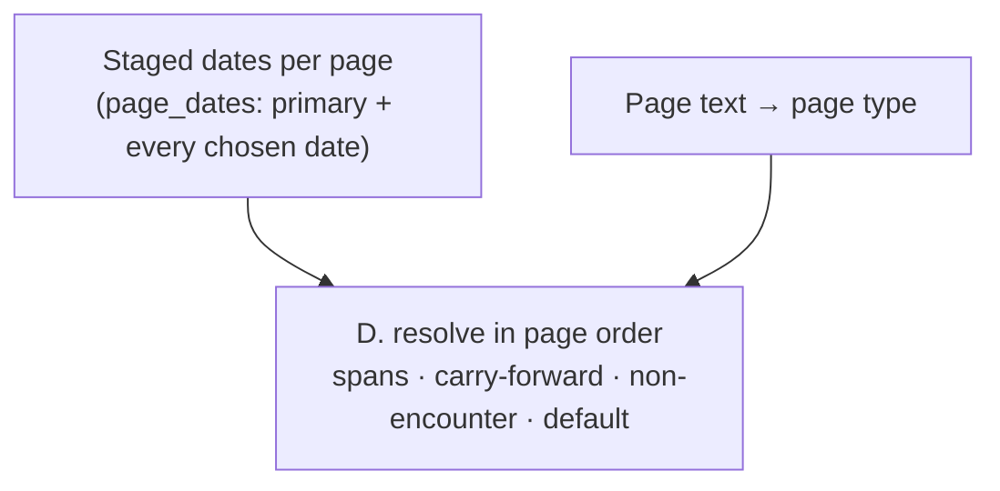

# Logic — how each decision is made, and what it writes

The reasoning inside each stage, and the exact rows it produces.
For the order things run in, see [FLOW.md](FLOW.md).

Every algorithm here is ported from the reference implementations under
the V1 prototypes. Where the port differs from them, it says so and why.

---

## Contents

1. [Preliminary OCR](#1-preliminary-ocr)
2. [Rotation and handwriting](#2-rotation-and-handwriting)
3. [Blank / junk / duplicate](#3-blank--junk--duplicate)
4. [Final OCR](#4-final-ocr)
5. [Member verification](#5-member-verification) ← the accept/reject decision
6. [Date of service](#6-date-of-service)
7. [Page type](#7-page-type)
8. [Encounter type](#8-encounter-type)
9. [Chart status](#9-chart-status)

---

## 1. Preliminary OCR

**Source:** V1 `ts_ocr.py` · **Stage:** `stages/lib/ocr/stage_prelim.py`

> Reads `corrected-pages/<n>.jpg` when stage 1 wrote one, else `pages/<n>.jpg`.
> A 270°-rotated page OCRs at ~0.01 text similarity to the same page upright;
> corrected it is ~1.0. See [SCALING.md](SCALING.md) for worker pool shape.

Tesseract over every page. Deliberately cheap and deliberately first: its only
job is to give the blank/junk classifier something to read, so pages can be
ruled out before the expensive OCR runs.



**Writes**

| Target | Columns |
|---|---|
| `ocr_results` | `page_id`, `ocr_type='tesseract'`, `raw_text`, `char_count`, `text_sha256` |
| `page_stage_status` | `stage_name='ocr_prelim'`, `pass_no=1`, `status` |
| disk | `ocr/<chart>_prelim.txt`, blocks delimited `===== <page_name> =====` |

`char_count` and `text_sha256` exist so later stages can test for "is there any
text" and "has this changed" without pulling the `TEXT` column.

The combined `.txt` is rebuilt from the database on every run, so a resumed run
still produces a file covering all pages — not just the ones it touched.

---

## 2. Rotation and handwriting

**Source:** `stages/lib/image_preprocess/rotation.py`, `hw_printed.py` · **Stage:** `stages/lib/image_preprocess/stage.py`

Two independent measurements per page.



The handwriting label is the single most consequential output of this stage: it
decides whether a page is judged in blank/junk pass 1 or held back to pass 2.

Both the classifier and the detector are built **once per process**. The v6
implementation rebuilt them inside the per-page function, unpickling the model
for every page in the chart.

**Writes**

| Target | Columns |
|---|---|
| `ocr_quality_results` | `printed_or_handwritten`, `hw_method`, `hw_confidence`, `orientation_angle`, `tilt_angle`, `mirrored`, `rotation_applied`, plus the placeholder `quality_tag` / `quality_score` |
| disk | `imaging/<chart>_rotation.csv`, `imaging/<chart>_hw_printed.csv` |

Both CSVs are rebuilt from the database, so a resumed run cannot leave a
half-written file.

Failure is non-fatal by design: an unreadable image falls back to
`printed / 0.5 / "fallback"` rather than stopping the chart. The fallback is
recorded in `hw_method` so it is distinguishable from a real prediction.

### `quality_tag` / `quality_score` are measured

Stage 2 runs `quality_analyzer` (engineering submetrics, 0–10). The stored
`quality_score` is in [0, 1] (`score / 10`). Tags:

| `quality_score` | `quality_tag` |
|---|---|
| ≥ 0.70 | `high` |
| ≥ 0.40 | `medium` |
| else | `low` |

**Post-process (teammate `image_preprocessing` rule):** if the page is
`handwritten` and the tag would be `high`, store **`medium`** instead. The
numeric `quality_score` is unchanged — only the discrete label moves. That
keeps Final2's `high_quality_printed` skip honest (handwritten pages never
qualified anyway) while the UI does not show a handwritten page as “high”.

Submetrics and warnings live in `quality_detail` JSONB. Handwriting is separate
(`printed_or_handwritten` / `hw_method` / `hw_confidence`) — ConvNeXt when the
`.pth` is present, otherwise the RF pickle. In v7 `quality_tag` wrongly held the
classifier method; that value now lives in `hw_method`.

---

## 3. Blank / junk / duplicate

**Source:** `advantmed-imaging-ui/02-imaging-pipeline/junk-classification/` → `stages/lib/blank_junk/` · **Stage:** `stages/lib/blank_junk/stage.py`

### Why two passes

Tesseract reads handwriting badly, and low-quality scans are unreliable on
prelim text. So handwritten / uncertain / mixed **and** `quality_tag=low`
pages skip pass 1 and are judged in pass 2 on final OCR (final2 if present,
else final1).



### The classifier

`classify_text()` returns one code; the order it tries them in is the priority:

| Code | Label | Detector |
|---|---|---|
| 1 | Blank | `blank.py` — empty OCR, declared-blank text, or a near-empty image |
| 2 | Invoice | `invoice.py` |
| 3 | Cover Page | `cover.py` |
| 5 | Record Request/Transmittal | `record_request.py` |
| 6 | Instructions | `instructions.py` |
| 8 | Letter/Fax | `letter_fax.py` |
| 7 | Others | `others.py` — gibberish OCR, signature-only pages |
| 0 | Main | nothing matched — a real chart page |

Codes map to `blank_junk_flag` as: blank → `blank`, duplicate → `duplicate`,
any junk code → `junk` (+ `junk_subtype`), else `not_blank_junk`.

> `JUNK_CODES` contains `CODE_BLANK`, but `blank` is checked first and wins — a
> blank page is flagged `blank`, never `junk`. Pinned by
> `tests/test_blank_junk_and_dos.py::test_blank_wins_over_junk_even_though_it_is_in_junk_codes`.

`junk_subtype` is constrained by a `CHECK` to the six labels the review UI
renders. Anything else the classifier produces maps to `Others` rather than
becoming an unrenderable string.

### Duplicate detection

Duplicates are checked **after** the model's verdict, and only between pages the
model kept as Main — a blank or junk page is never compared. A Main page is a
duplicate when its normalized OCR text is **≥ 98% similar**
(`difflib.SequenceMatcher`) to a Main neighbor **within ±2 pages** in chart
order, or when its text is **wholly contained** in that neighbor's.

| Rule | Behaviour |
|---|---|
| Window | Compare only pages 2 before / 2 after (page order) |
| Threshold | Similarity **≥ 0.98** on whitespace-stripped lowercase text (UI: 100% → Yes, [98%, 100%) → May Be; May Be display confidence = `1 + (sim − 1) × 10`, e.g. 98%→80% / 99%→90%) |
| Containment | The shorter page's normalized text appears whole inside the longer one → duplicate, confidence 1.0 |
| Who wins | Higher normalized character count stays **main**; on a tie, the **earlier** page |
| Excluded | Blank / junk pages and texts shorter than 300 normalized characters (~50 words) |
| Cross-pass | Prior-pass `main` pages are neighbors in pass 2 (so HW can match a printed original) |

`duplicate_of_page_id` records the kept original. A demoted prior-main page gets
an updated row on the current pass.

### One final verdict

Each pass writes its own row (`UNIQUE (page_id, pass_no)`). Then
`mark_blank_junk_final()` stamps the highest pass per page, and a partial unique
index (`WHERE is_final`) makes "two finals for one page" unrepresentable.
Downstream stages read `v_page_blank_junk_final` and never re-derive precedence.

**Writes**

| Target | Columns |
|---|---|
| `blank_junk_classification` | `pass_no`, `blank_junk_flag`, `junk_subtype`, `duplicate_of_page_id`, `ocr_source`, `confidence`, `reason`, `is_final` |
| disk | `imaging/<chart>_junk.csv` — **fully rewritten from the database** after each pass |

> v6 truncated the CSV in pass 1 and appended in pass 2, so re-running pass 2
> alone duplicated every row. The full rewrite makes the file converge.

---

## 4. Final OCR

**Stages:** `stages/lib/ocr/stage_final1.py` (Docling layout + RapidOCR; falls back to RapidOCR-onnx only on a page timeout or a crash), `stages/lib/ocr/stage_final2.py` (Azure Document Intelligence `prebuilt-read`)

Both run on pages not ruled out by pass 1, **plus every handwritten /
low-quality page**. Azure final2 additionally **skips high-quality printed**
pages (`skip_reason=high_quality_printed`) — final1 is enough for them.



`ocr_type='docling'` is the slot the review UI labels "Final (OSS)". When Docling
and the RapidOCR `.pth` models under `RAPID_MODELS_DIR` are ready, final1 uses
Docling's layout / TableFormer / reading-order pipeline (V1 `os_ocr.py`).
Otherwise it falls back to **RapidOCR-onnx only** (no Tesseract — prelim already
did that). Either way the on-disk artifact is `ocr/<chart>_final1.json`. See
[`docs/API.md` § Optional model weights](API.md#optional-model-weights-not-pip).

**final1 and final2 store JSON**, not bare text: `{pageNumber, fileName, content, …}`.
final1 also carries `markdown` and (when Docling ran) the full `document`
layout dump. Every consumer unwraps `content` — the review UI's Postgres and
Local adapters do it too.

Both engines/clients are built once per process. Stage 5 is the one billed per
page, which is why `pages_needing_stage` exists: a resumed run sends only the
pages that never completed.

When Azure DI is not configured the stage logs a warning and produces no text.
Member/DOS then use final1 (and prelim only for printed non-low-quality pages).

---

## 5. Member verification

**Source:** V1 `Member_Verification/` → `core-pipeline/stages/lib/member/`
**Stage:** `stages/lib/member/stage.py`

This stage produces the accept/reject decision. The verification is a faithful port —
function names, call order and thresholds match the reference so a run is diffable
against it page for page. What changed is where a page's name, DOB and ID come from:
the key/value extraction ([EXTRACTION.md](EXTRACTION.md)) reads them once, right after
OCR, and this stage checks what it staged.

### The central idea: extract once, verify against the manifest

The extraction does not know the manifest. It finds the member name, DOB and ID on
every page wherever the page keeps them (`name`, `dob`, `member_id`). Verification then
asks, per page, whether what was extracted is *this* member:



A page the extraction could not read (no Final2 word boxes) finds nothing: it is
not verified, and not wrong either. `detection_source_*` is `ner` when GLiNER read the
value and `rule_based` otherwise; `ner_key_source_*` is the key it was found under.

### The verification rule (`rules/base_rules.py`)

```
name not matched                        → Reject
name matched, initial only              → Accept iff DOB **and** MemberID found
name matched, both parts full           → Accept iff DOB **or** MemberID found
```

A name on its own is never enough. An initial-only match ("J Anderson") needs
both corroborators, because a single initial plus a surname is weak evidence.

| Name evidence | DOB | MemberID | Verdict |
|---|---|---|---|
| `Justin Anderson` | ✓ | — | **Accept** |
| `Justin Anderson` | — | ✓ | **Accept** |
| `Justin Anderson` | — | — | Reject |
| `J Anderson` | ✓ | ✓ | **Accept** |
| `J Anderson` | ✓ | — | Reject |
| `Marcus Anderson` | ✓ | ✓ | Reject — a *different* member |

That last row is the one that matters: a matching surname next to a different
given name is classified `ONE_FULL_WRONG`, not "partial match".

### The three page buckets



A page with nothing detected is **not** evidence of another member — it is
merely unverified. Only a page that positively names someone else counts.

### The document decision (`rules/what_if_rules.py`)

```
reject_threshold(total_pages) = max(1, min(5, ceil(total_pages × 0.10)))
document = Reject  if  wrong_member_pages ≥ reject_threshold
           Accept  otherwise
```

| Chart size | Rejects at |
|---|---|
| 3 pages | 1 wrong page |
| 12 pages | 2 |
| 40 pages | 4 |
| 60+ pages | 5 (the cap) |

The threshold is computed on the chart's **whole** page count, not on the subset
that reached this stage — blank/junk pages are excluded from checking but still
count toward the document's size. Pinned by
`test_threshold_uses_the_whole_document_not_the_subset`.

### Wrong member needs the extraction

`wrong_member_on_page()` decides from the member names the extraction found on the
page. The extraction is required: without its packages or weights the `kv_extract` stage
fails the chart (`GET /health` → `extraction.reason` says which), so there is no
rules-only mode in which nothing can be rejected. Pages the extraction cannot read are the
exception — see [EXTRACTION.md](EXTRACTION.md#pages-with-no-word-boxes).

### Writes

| Target | Columns |
|---|---|
| `member_extraction_results` (one per page) | `extracted_name/dob/member_id`, `detection_source_name/dob/member_id` (`rule_based`\|`ner`\|`''`), `ner_key_source_*` (which key sentence), `page_status` (`verified`\|`wrong_member`\|`not_verified`), `page_verified`, `confidence`, `provided_*`, `matched_member_list_id` |
| `member_verification_summary` (one per chart) | `final_status`, `document_decision` (`accept`\|`reject`), `name_mode`, `pages_checked`, `pages_matched`, `wrong_member_pages`, `reject_threshold`, `decision_reason` |
| disk | `_member_extraction.csv`, `_member_verification.csv`, `_member_v1_compare.csv` |

`_member_v1_compare.csv` is written in the **reference's own column order**
(`RecordId, Total_Page_Count, Page_No, Detection_Source_Name, …`) so a pipeline
run can be diffed directly against a V1 run.

`final_status` triages for the reviewer; `document_decision` is the business
outcome:

| Condition | `final_status` | `document_decision` |
|---|---|---|
| wrong-member pages ≥ threshold | `failed` | `reject` |
| ≥ 1 page verified | `verified` | `accept` |
| every page blank/junk/duplicate | `skipped` | *(null)* — chart still `completed` |
| no manifest row for the record | `needs_review` | *(null)* |
| manifest has no usable name | `needs_review` | `accept` |
| pages checked, none verified | `needs_review` | `accept` |

`confidence` is derived, not a model score: 0.5 for a verified page plus ~1/6
per field found, rule-read values weighted above GLiNER-read ones. The reference carried no numeric
confidence — it reported detection source per field, which is what the UI shows.

---

## 6. Date of service

**Dates:** found by the key/value extraction ([EXTRACTION.md](EXTRACTION.md)) ·
**Resolve:** `stages/lib/dos/resolve.py` · **Stage:** `stages/lib/dos/stage.py` ·
**Profile:** `keyword-canon/dos_canon.json` (page types, default date — reloads on change)

The extraction chooses each page's date of service — the labelled date, or an admit +
discharge pair as one range — with its own score. This stage resolves the chart page by
page: which encounter a page belongs to, and what a page with no date inherits. The
candidate scoring, the label weights and the Azure OpenAI fallback of the earlier
engine are gone.



### D. Resolve

| Page | Page level | Document level |
|---|---|---|
| Progress Note with a date | its date | opens a span with it (`span_start`) |
| In a span, own date ≤ 0.75 | its date | the span's (`span`) |
| Own date > 0.75, or no span | its date | its date — the new encounter |
| Non-encounter page type (face sheet, demographics, problem/med/allergy list, vitals, immunization) | its date | the current encounter, never replaced (`non_encounter_page`) |
| No date ≥ threshold | blank | the current encounter (`carry_forward` / `span`) |
| Nothing to inherit | blank | `DOS_DEFAULT_DATE`, confidence 0, `no_date_found`, `is_default` |

Page types are exact `page_type` names from `codeable_canon.json`, listed in
the profile.

### Settings (profile)

| Key | Default | Meaning |
|---|---|---|
| `DOS_DEFAULT_DATE` | 2022-02-02 | Delivered when nothing is found. review-ui and `encounter_classify` also know this value. |
| `span_override_score` | 0.75 | A date scoring at or below this inside a progress-note span is replaced by the span's |

The *score* is the extraction's own for the chosen date.

**Writes**

| Target | Columns |
|---|---|
| `dos_extraction_results` | `date_of_service_from/to`, `..._doclevel` (single-valued), `dates` (JSONB array of `{seq, date_of_service_from, date_of_service_to, source_keyword, confidence}`), `extraction_method` (always `rules` now; the column still allows `llm` / `rules+llm`), `confidence`. `date_count` is generated from `dates`. |
| disk | `imaging/<chart>_dos.csv` |

---

## 7. Page type

**Engine:** `stages/lib/page_classify/codeable_classify.py` · **Stage:**
`stages/lib/page_classify/stage.py` · **Catalog:**
`keyword-canon/codeable_canon.json` (reloads on change)

Every main page (not blank / junk / duplicate) is matched against 253 page
types grouped into 29 families. **The decision is made per family**, and the
family carries the tag: a family is all Codeable, all Non Codeable or all
Discharge Frequency, never mixed. The output `page_type` (CSV) and
`page_classification.page_subtype` are **`Family (Page Type)`** — e.g.
`Progress Note (SOAP Note)`, or just `Progress Note` when the type has the
family's name. Blank, junk and duplicate pages are always Non Codeable.

| Family | Tag | Priority | Types |
|---|---|---|---|
| Progress Note | Codeable | 10 | 30 |
| Discharge | Discharge Frequency | 20 | 20 |
| Obstetric | Codeable | 30 | 5 |
| Procedure | Codeable | 30 | 18 |
| Assessment / Screening | Codeable | 40 | 14 |
| Behavioral Health | Codeable | 40 | 4 |
| Care Plan | Codeable | 40 | 6 |
| Inpatient / Critical Care | Codeable | 40 | 12 |
| Specialty Consult | Codeable | 40 | 11 |
| Therapy / Rehab | Codeable | 40 | 11 |
| Ophthalmology | Codeable | 45 | 7 |
| Screening / Checklist | Non Codeable | 45 | 6 |
| Cardiac Diagnostic | Codeable | 50 | 9 |
| Neuro Diagnostic | Codeable | 50 | 6 |
| Pulmonary Function Test | Non Codeable | 50 | 1 |
| Pulmonary / Sleep | Codeable | 50 | 5 |
| Vascular / Holter | Non Codeable | 50 | 5 |
| Imaging | Non Codeable | 55 | 12 |
| Laboratory | Non Codeable | 55 | 15 |
| Nuclear Medicine | Codeable | 55 | 2 |
| Pathology | Codeable | 55 | 6 |
| Medication / Immunization | Non Codeable | 60 | 6 |
| Therapy Administration | Codeable | 60 | 3 |
| Consent / Authorization | Non Codeable | 70 | 7 |
| Orders / Requests | Non Codeable | 70 | 7 |
| Letter | Codeable | 75 | 1 |
| Patient Communication | Non Codeable | 75 | 8 |
| Administrative | Non Codeable | 80 | 14 |
| Demographics | Codeable | 80 | 2 |

### The catalog

```json
{
  "id": "soap_note",
  "display": "SOAP Note (Subjective, Objective, Assessment, Plan)",
  "family": "progress_note",
  "continue": true,
  "match": {
    "primary":    ["soap note"],
    "supporting": ["assessment", "subjective", "objective"],
    "variants":   []
  }
}
```

| Field | Meaning |
|---|---|
| `id` | Stable key. `display` is what the reviewer sees (parentheticals hidden) |
| `family` | One of the `families` block. A family has a `tag`, a `priority` (lower wins ties) and `span`; the type takes its tag from the family and may not carry its own |
| `match.primary` | Decides the type and can open a span. Belongs to exactly one entry. Two or more words, or a word in `single_word_primary` |
| `match.variants` | Misspellings from the client's type list (`intial`, `requisation`, `dignosis`). Count as primary |
| `match.supporting` | Adds score, never decides the type |
| `continue` | The type runs over several pages: it opens a span for its family |

**The loader refuses a bad file** and names every offending entry: a primary
claimed by two entries, a one-word primary not on the allowlist, an entry with
no primary, an unknown family, a family without a valid tag, or a type that
carries its own tag. On a live reload the last good version
keeps serving; on first load the error is raised.

### Scoring

Text is lowercased with whitespace collapsed. Keywords match on word
boundaries, so `ems` does not hit "problems" and `sex` does not hit "sexual".

```
hit_weight  = phrase_weight[words] × band
phrase_weight: 1 word 1 · 2 words 4 · 3 words 6 · 4+ words 8
band:          top 15% of the page 2.0 · bottom 10% 0.5 · elsewhere 1.0
family_score = sum of the hits of every type in the family
               (a phrase two of its types share counts once per position)
```

A type name at the top of a page is the document's title; the same phrase in
the body is usually a cross-reference ("see discharge summary"), and a footer
usually repeats a form name.

### Picking the type

1. A family is eligible when at least one of its hits is a primary or variant.
2. **Family:** the highest family score wins; on a tie, the lower priority
   (`progress_note` 10, `discharge` 20). The family decides the tag.
3. **Type:** inside that family, each eligible type's share of the family's
   type scores is its probability; the most likely type wins (ties: the longer
   name). It is reported as `type_confidence`.

**Dominance:** a family listed in `matching.dominant_families` wins outright
once its score reaches the threshold — Progress Note at 12, e.g. three
section headers in the body, or a header title plus one more hit — however
much the other families score.

**Fill between:** after spans, a page that matched nothing and sits between two
pages of a family in `matching.fill_between_families` (Progress Note) takes
that family, the previous page's type and the lower neighbour confidence
(`continue_applied=y`; `filled_between` in the evidence log).

**Confidence** = `(winning family − next family) / winning family`, at least
`confidence_floor` (0.30); 1.0 when no other family matched. Two Progress Note
types scoring the same is not uncertainty — either gives the same family and
tag.

**Demographics** is decided separately when patient-data fields cluster (two on
pages 1–2, four anywhere), unless a span family (progress note, discharge)
also matched.

### Spans

| Page | Result |
|---|---|
| Winner has `continue` | Opens (or replaces) a span for its family |
| Same date as the span, matched a type in the span's family | That type, the span's tag (`continue_applied=y`) |
| Same date, matched nothing or another family | The opener's type and tag (`continue_applied=y`) |
| Different date, or no date | Span ends |

The span date is the page-level DOS, else the document-level one. The DOS
default (`DOS_DEFAULT_DATE`) counts as no date, so pages where date extraction
failed share a span with nobody.

### Evidence

`PAGE_CLASSIFY_DEBUG=true` writes
`<chart>/debug/<chart>_page_classify_evidence.csv`: per page, the chosen type
and family, per-family scores, every keyword hit with its role and band, page
position in the chart, the previous page's family and the OCR source. It is the
reviewer's "why" and the training set for a family-level classifier.

**Writes**

| Target | Columns |
|---|---|
| `page_classification` | `page_subtype` (display name), `classification_category`, `confidence` |
| disk | `imaging/<chart>_codeable.csv` |

---

## 8. Encounter type

**Engine:** `stages/lib/encounter/encounter_classify.py` · **Stage:**
`stages/lib/encounter/stage.py` · **Catalog:** `keyword-canon/encounter_canon.json`

One answer per visit — Outpatient (F2F), Outpatient (Tele), Inpatient or Home —
stamped on every page of the visit. **Evidence is ranked, not added up:** the
most authoritative evidence a visit has decides alone, so repeated "follow up"
can never outweigh one discharge summary.

### Visits

A visit is a run of **consecutive** pages sharing a date: the page's
document-level DOS, else its page-level DOS. The DOS default
(`DOS_DEFAULT_DATE`) is the absence of a date. A page without a usable date is
a visit of its own and stays unresolved (`no_date` / `default_date`). The same
date forty pages later is a second visit.

### Evidence

Each finding is recorded **once per visit**, however often its words appear.

| Tier | What | Decides? |
|---|---|---|
| 1 | A page type that exists in one setting only (`tier1_page_types`, keyed on the page type id). It must be matched on the page, not inherited from a span | Yes, alone |
| 2 | Text naming the setting: "telehealth", "hospital course", "home health visit", "place of service" | Only when tier 1 is empty |
| 3 | Hints found in several settings: "chief complaint", "follow up", "consultation", "h&p" | Never — breaks a tie inside the deciding tier |
| context | "radiology report", "mri report" … | Logged only |

Phrases match on word boundaries; a phrase ending in punctuation (`a/p:`,
`hpi:`) has no trailing boundary. **Negatives** ("discharged home",
"telephone message", "follow up with your primary care") remove the tier 2/3
finding they name, or every tier 2/3 finding of a setting. They never touch
tier 1.

### Decision

| Situation | Answer | `confidence` |
|---|---|---|
| Tier 1, one setting | that setting | 0.95 |
| Tier 1, two settings | more tier 3 hints, then setting priority (Home 10, Tele 20, F2F 30, Inpatient 40); `conflict=y` | 0.70 |
| Tier 1 empty, tier 2 one setting | that setting | 0.80 |
| Tier 2, two settings | as above; `conflict=y` | 0.60 |
| Nothing in tiers 1–2 | empty, `reason=no_setting_evidence` | 0 |

An unresolved visit never inherits from a neighbouring page. The buckets live
in the catalog; calibrate them against a labelled sample.

The **loader refuses** a catalog where a setting is unknown, a tier 1 id is not
a page type id, a phrase sits in two tiers or under two settings, a context
phrase also scores, or a negative cancels a phrase that does not exist.

### Writes

| Target | Columns |
|---|---|
| `encounter_type_results` | resolved pages only: `encounter_type`, `confidence`, `matched_keyword`. Rows for pages that are now unresolved are deleted |
| disk | `imaging/<chart>_encounter.csv`, every page: `encounter_type`, `encounter_label`, `confidence`, `matched_keyword` (page type for tier 1, phrase for tier 2), `continue_applied` (the page alone would answer differently or not at all), `decided_by` (`tier1`/`tier2`/`unresolved`), `reason`, `conflict` |

`ENCOUNTER_DEBUG=true` writes one evidence record per visit to
`<chart>/debug/<chart>_encounter_evidence.csv`: every finding with its tier,
source and page, cancelled findings, negatives that fired, context, the
deciding tier, the winner and any contender.

---

## 9. Chart status

**Module:** `core-pipeline/db/chart_status.py`

```
current_stage = earliest stage, in pipeline_stage.seq order,
                where not every page is completed|skipped
```

| Condition (checked in order) | `status` |
|---|---|
| No pages yet | `received` / `downloading` |
| A page `failed` in a stage that is not otherwise complete | `failed` |
| Some stage incomplete | `processing` (+ `current_stage`, `current_pass`) |
| All done, member `final_status='needs_review'` | `needs_review` |
| All done (including member `document_decision='reject'`) | `completed` |

Accept/reject is recorded on `member_verification_summary` only — `chart_list.status`
is never set to `rejected` (legacy value remapped by `schema/patch_output_path.sql`).

A page that `failed` in an otherwise-finished stage does **not** fail the chart —
every page reached a terminal state, so the stage is done and the failure stays
recorded on the page.

`skipped` counts as done, so a chart of entirely blank pages still reaches
`completed`.

### Why v7 split the column

v6 packed the stage name into `chart_list.status`, so:

- every new stage needed a `CHECK`-constraint migration, and
- **two passes of one stage were unrepresentable** — `blank_junk` appeared once
  in the ordering, before `ocr_final1`, so a chart sitting in pass 2 reported
  blank/junk already finished.

v8 uses lifecycle `status` + `current_stage` + `current_pass`, with order in the
`pipeline_stage` table.

---

## Where the logic lives

| Concern | File |
|---|---|
| Stage order, skip rules | `core-pipeline/orchestrator/runner.py`, `stages/_support.py` |
| Blank/junk detectors | `core-pipeline/stages/lib/blank_junk/` |
| Member verification rules | `core-pipeline/stages/lib/member/` |
| Key/value extraction (member, DOS, page no, headings) | `core-pipeline/stages/lib/extraction/` |
| Member driver (ported `run.py`) | `core-pipeline/stages/lib/member/engine.py` |
| DOS resolution (spans, carry-forward, default) | `core-pipeline/stages/lib/dos/resolve.py` |
| Status derivation | `core-pipeline/db/chart_status.py` |
| Persistence | `core-pipeline/db/__init__.py` |

Behaviour above is pinned by `tests/` (253 tests). A failure there means the port
has drifted from the reference — the fix is to restore it, not to update the
expectation.
